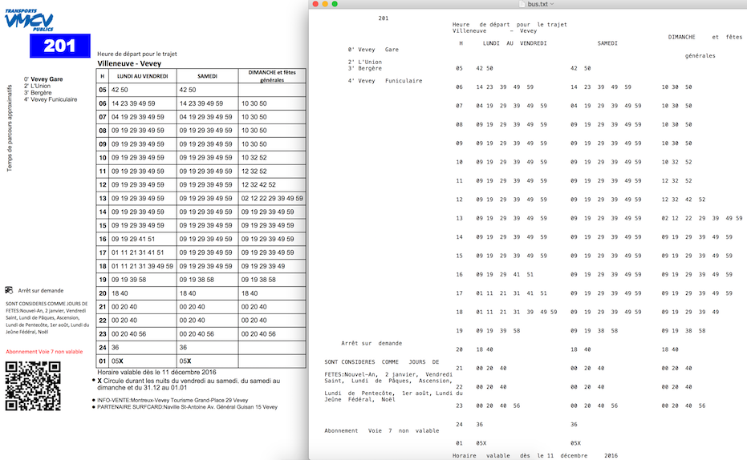
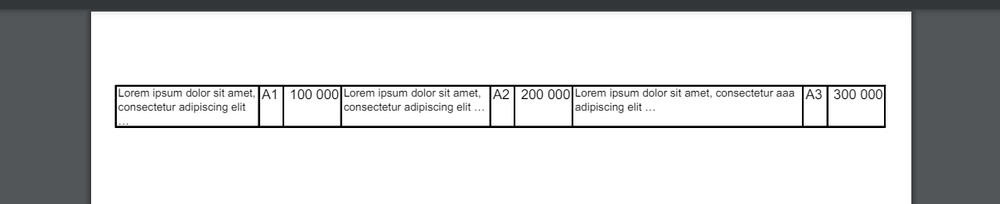

# pdftextstripper

A simple tool built on top of [pdfminer.six](https://pdfminersix.readthedocs.io) to extract the content of a pdf keeping together information on the same line.

Inspired by the Java's library [PDFLayoutTextStripper](https://github.com/JonathanLink/PDFLayoutTextStripper). The result are not visually as good as this library, but they tend to keep the full content, especially when there are different font sizes and lots of text in the document.

It can be helpful to parse PDF tables.

## Install

Clone this repository, go in its root folder and run:

```bash
pip install .
```

## Use

```python
from pdfminer.high_level import extract_pages
from pdftextstripper import PdfTextStripper

test_file = open(insert_your_path_here, 'rb')

doc = extract_pages(test_file)
page = next(doc)

stripper = PdfTextStripper()
text = stripper.process_page(page)
print(text)
```

## Notes

While [PDFLayoutTextStripper](https://github.com/JonathanLink/PDFLayoutTextStripper) is great, it is not written in Python, and trying to convert it to Python did not work well for me. I needed to use pdfminer.six to get the position of every glyph in the document. However, the results were not very good because PDFLayoutTextStripper uses a fixed length for the line, which does not allow all content to be displayed correctly when there are different font sizes or simply lots of text.

This library instead tries to keep all the content of the lines intact.

## How does it work ?

1. We get all characters of the document with their positions, replacing spaces ` ` and newlines `\n` with pipes `|` for better visualization.
2. We sort the characters in the Y-direction.
3. We build the output line by line by adding the characters.
4. We start a new line when the new character's Y-position is more than the previous one's Y-position plus its height.
5. Once a new line is detected, we sort the elements on this line in the X-direction.
6. We try to detect new lines again on this line by running the step 4.
7. And so on.

## Support

Please [open an issue](https://github.com/thomassimmer/pdftextstripper/issues/new/) for
support.

## Contributing

Please contribute using [Github Flow](https://guides.github.com/introduction/flow/). Create a branch, add commits, and [open a pull request](https://github.com/thomassimmer/pdftextstripper/compare).

## License

pdftextstripper is released under the MIT License. See the LICENSE file for more details.

## Benchmarks

### Use case 1: Not many characters on one line

#### Results if you use [PDFLayoutTextStripper](https://github.com/JonathanLink/PDFLayoutTextStripper)



#### Results if you use pdf2txt (from pdfminer)

```
201 Heure de départ pour le trajet

Villeneuve - Vevey

0' Vevey Gare
2' L'Union
3' Bergère
4' Vevey Funiculaire

s
f
i
t

i

a
m
x
o
r
p
p
a

s
r
u
o
c
r
a
p
e
d

s
p
m
e
T

Arrêt sur demande

SONT CONSIDERES COMME JOURS DE
FETES:Nouvel-An, 2 janvier, Vendredi
Saint, Lundi de Pâques, Ascension,
Lundi de Pentecôte, 1er août, Lundi du
Jeûne Fédéral, Noël

Abonnement Voie 7 non valable

H

LUNDI AU VENDREDI

SAMEDI

05

 42 50

 42 50

DIMANCHE et fêtes
générales

06  14 23 39 49 59

 14 23 39 49 59

 10 30 50

07

 04 19 29 39 49 59

 04 19 29 39 49 59

 10 30 50

08  09 19 29 39 49 59

 09 19 29 39 49 59

 10 30 50

09

 09 19 29 39 49 59

 09 19 29 39 49 59

 10 30 50

10  09 19 29 39 49 59

 09 19 29 39 49 59

 10 32 52

11

 09 19 29 39 49 59

 09 19 29 39 49 59

 12 32 52

12  09 19 29 39 49 59

 09 19 29 39 49 59

 12 32 42 52

13

 09 19 29 39 49 59

 09 19 29 39 49 59

 02 12 22 29 39 49 59

14  09 19 29 39 49 59

 09 19 29 39 49 59

 09 19 29 39 49 59

15

 09 19 29 39 49 59

 09 19 29 39 49 59

 09 19 29 39 49 59

16  09 19 29 41 51

 09 19 29 39 49 59

 09 19 29 39 49 59

17

 01 11 21 31 41 51

 09 19 29 39 49 59

 09 19 29 39 49 59

18  01 11 21 31 39 49 59  09 19 29 39 49 59

 09 19 29 39 49

19

 09 19 39 58

 09 19 38 58

 09 19 38 58

20  18 40

21

 00 20 40

22  00 20 40

 18 40

 00 20 40

 00 20 40

 18 40

 00 20 40

 00 20 40

23  00 20 40 56

 00 20 40 56

 00 20 40 56

24  36

01

 05X

 36

 05X

l

Horaire valable dès le 11 décembre 2016
X Circule durant les nuits du vendredi au samedi, du samedi au
dimanche et du 31.12 au 01.01

l
l

INFO-VENTE:Montreux-Vevey Tourisme Grand-Place 29 Vevey
PARTENAIRE SURFCARD:Naville St-Antoine Av. Général Guisan 15 Vevey
```

#### Results if you use pdftextstripper

```
201 | Heure de départ pour le trajet |
sfi |  |  | 0' | Vevey Gare | Villeneuve - Vevey | DIMANCHE et fêtes  |
2' | L'Union | H | LUNDI AU VENDREDI | SAMEDI | générales |
t | 05 |  42 50 |  42 50 |
a | 3' | Bergère |
mi |  | 4' | Vevey Funiculaire | 06 |  14 23 39 49 59 |  14 23 39 49 59 |  10 30 50 |
x |
or |  |
pp |  |
a | 07 |  04 19 29 39 49 59 |  04 19 29 39 49 59 |  10 30 50 |
sr |  |
u |
ocr |  |  | 08 |  09 19 29 39 49 59 |  09 19 29 39 49 59 |  10 30 50 |
a |
p |
e | 09 |  09 19 29 39 49 59 |  09 19 29 39 49 59 |  10 30 50 |
d |
s |
p | 10 |  09 19 29 39 49 59 |  09 19 29 39 49 59 |  10 32 52 |
me |  |
T | 11 |  09 19 29 39 49 59 |  09 19 29 39 49 59 |  12 32 52 |
12 |  09 19 29 39 49 59 |  09 19 29 39 49 59 |  12 32 42 52 |
13 |  09 19 29 39 49 59 |  09 19 29 39 49 59 |  02 12 22 29 39 49 59 |
14 |  09 19 29 39 49 59 |  09 19 29 39 49 59 |  09 19 29 39 49 59 |
15 |  09 19 29 39 49 59 |  09 19 29 39 49 59 |  09 19 29 39 49 59 |
16 |  09 19 29 41 51 |  09 19 29 39 49 59 |  09 19 29 39 49 59 |
17 |  01 11 21 31 41 51 |  09 19 29 39 49 59 |  09 19 29 39 49 59 |
18 |  01 11 21 31 39 49 59 |  09 19 29 39 49 59 |  09 19 29 39 49 |
19 |  09 19 39 58 |  09 19 38 58 |  09 19 38 58 |
Arrêt sur demande | 20 |  18 40 |  18 40 |  18 40 |
SONT CONSIDERES COMME JOURS DE  | 21 |  00 20 40 |  00 20 40 |  00 20 40 |
FETES:Nouvel-An, 2 janvier, Vendredi  |
Saint, Lundi de Pâques, Ascension,  | 22 |  00 20 40 |  00 20 40 |  00 20 40 |
Lundi de Pentecôte, 1er août, Lundi du  |
Jeûne Fédéral, Noël | 23 |  00 20 40 56 |  00 20 40 56 |  00 20 40 56 |
Abonnement Voie 7 non valable | 24 |  36 |  36 |
01 |  05X |  05X |
Horaire valable dès le 11 décembre 2016 |
l | X Circule durant les nuits du vendredi au samedi, du samedi au |
dimanche et du 31.12 au 01.01 |
l | INFO-VENTE:Montreux-Vevey Tourisme Grand-Place 29 Vevey  |
l | PARTENAIRE SURFCARD:Naville St-Antoine Av. Général Guisan 15 Vevey  |
```

### Use case 2: Many characters on one line



#### Results if you use [PDFLayoutTextStripper](https://github.com/JonathanLink/PDFLayoutTextStripper)

```
     Lorem ipsum dolor  sit amet,  A1 100  000 Lorem  ipsum  dolor  sit  amet, A2 200 000 Lorem  ipsum  dolor sit  amet,  consectetur  aaa    A3300
     consectetur  adipiscing  elit           consectetur  adipiscing  elit …           adipiscing  elit  …
     …
```

#### Results if you use pdf2txt (from pdfminer)

```
Lorem ipsum dolor sit amet,
consectetur adipiscing elit
…

A1 100 000 Lorem ipsum dolor sit amet,
consectetur adipiscing elit …

A2 200 000 Lorem ipsum dolor sit amet, consectetur aaa

adipiscing elit …

A3 300 000
```

#### Results if you use pdftextstripper

```
Lorem ipsum dolor sit amet,  | A1 | 100 000 | Lorem ipsum dolor sit amet,  | A2 | 200 000 | Lorem ipsum dolor sit amet, consectetur aaa   | A3 | 300 000 |
consectetur adipiscing elit  | consectetur adipiscing elit … | adipiscing elit … |
… |
```
